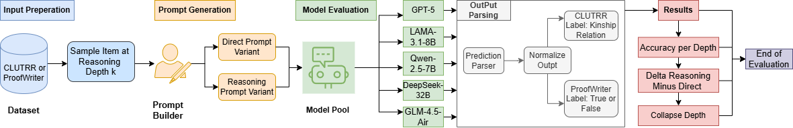
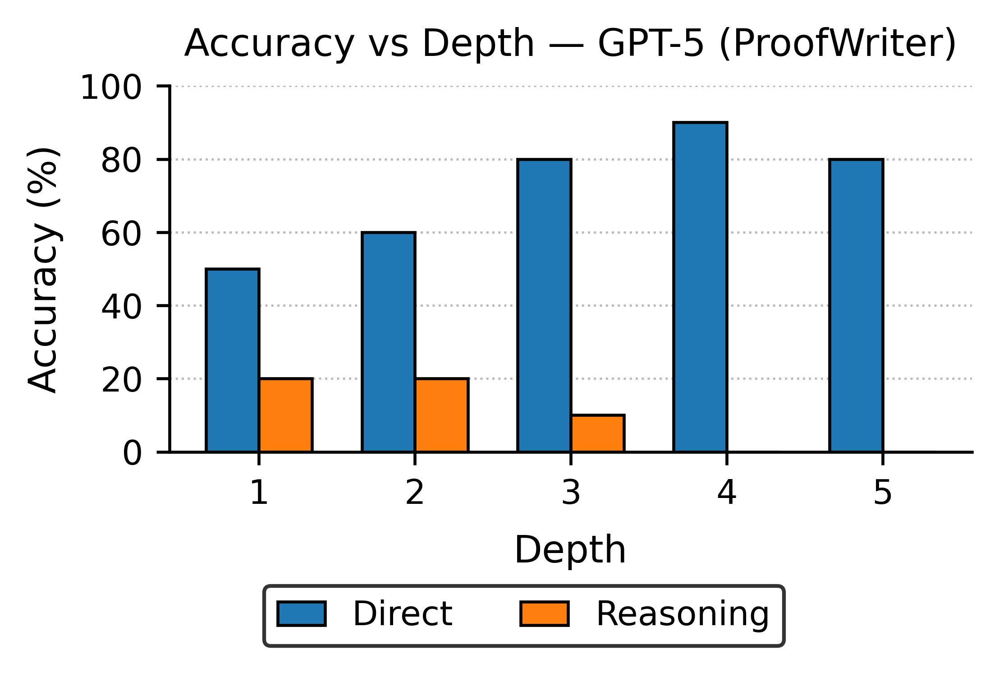
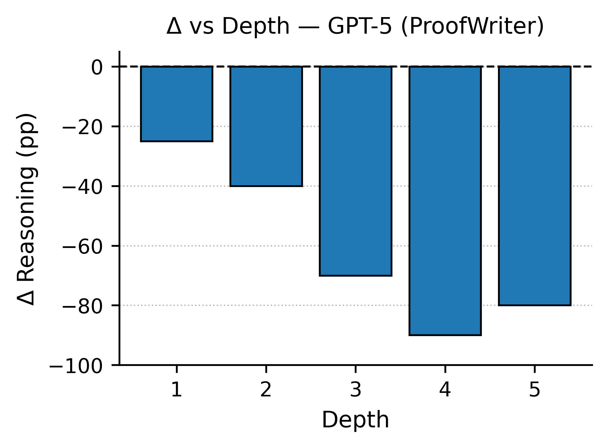
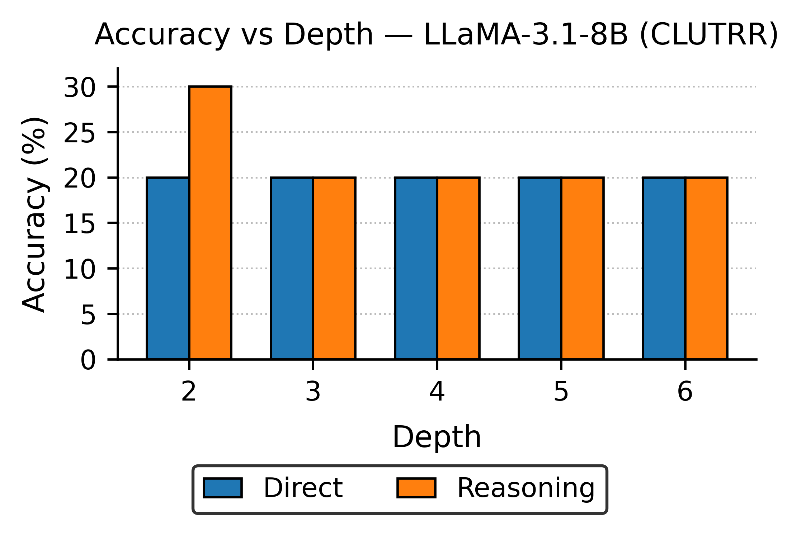
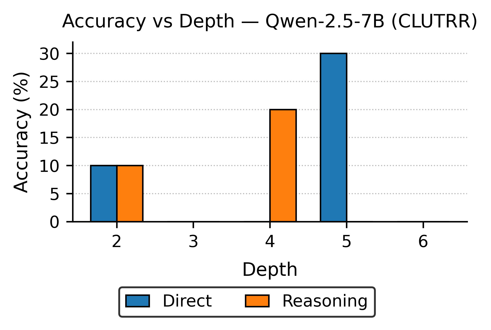

# When Reasoning Collapses: A Depth-Aware Probe into LLM Reasoning

## What This Work Is About
This project evaluates how reasoning performance in large language models degrades as **reasoning depth** increases.  
We compare **direct answers vs. reasoning prompts** across structured datasets (CLUTRR, ProofWriter) and multiple LLMs (GPT-5, LLaMA-3.1-8B, Qwen-2.5-7B, DeepSeek-32B, GLM-4.5-Air).  
The findings show that reasoning gains at shallow depths collapse sharply as tasks become more compositional.

## Architecture Diagram

  

## Key Graphs

### GPT-5 (ProofWriter)

  

  

### LLaMA-3.1-8B (CLUTRR)

  

### Qwen-2.5-7B (CLUTRR)

  

## Publication
### AAAI-26 Student Abstract  
**Paper link:** *(final AAAI link)*  
**PDF in repo:** `Student_Abstract_AAAI.pdf`

## Conclusion
Reasoning prompts help only at **very shallow depths**.  
As depth increases, accuracy drops sharply, and in many cases reasoning accuracy falls **below direct answers**, revealing that current LLM reasoning is **brittle, depth-sensitive, and unstable**.  
This framework provides a simple, reproducible way to measure collapse-depth and compare reasoning robustness across models.

